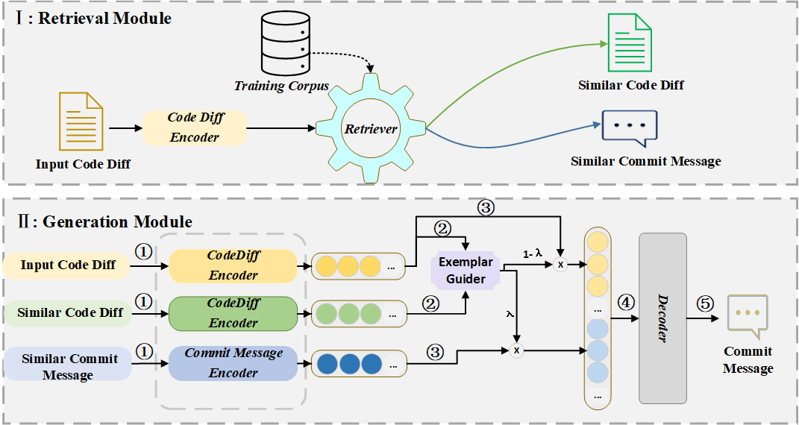

# RACE: Retrieval-Augmented Commit Message Generation


## The architecture Model 
We propose a novel model RACE, which retrieves a similar commit message as an exemplar, guides the neural model to learn the content of the code diff and the intent behind the code diff, and generates the readable and informative commit message.
Specifically, our model includes two modules: retrieval module and generation module. Specifically, RACE firstly retrieves the most semantically similar code diff paired with the commit message from the large parallel training corpus. The semantic similarity between two code diffs is measured by the cosine similarity of vectors obtained by a code diff encoder. Next, RACE treats the retrieved commit message as an example and uses it to guide the neural network to generate an understandable and concise commit message.




##  Environment

```
conda create -n RACE python=3.6 -y
conda activate RACE
pip install torch==1.10 transformers==4.12.5 tqdm==4.64.1 prettytable==2.5.0 gdown==4.5.1 more-itertools==8.14.0 tensorboardX==2.5.1 setuptools==59.5.0  tensorboard== 2.10.1
```
## Dataset


The dataset MCMD has five programming languages (PL): Java, C#, Cpp, Python and JavaScript. The dataset can be downloaded [here](https://zenodo.org/record/7196966#.Y0juJHZBxmM). More info about MCMD can be found [here](https://github.com/DeepSoftwareAnalytics/CommitMsgEmpirical/tree/main/dataset). We use the filtered dataset in our work.

**Statistics of dataset**

| language   | Training |  Valid   |  Test  |
| :--------- | :------: | :----: | :----: |
| Java | 160,018 |19,825|20,159|
| C#| 149,907 |18,688 |18,702|
| Cpp | 160,948 |20,000 |20,141|
| Python | 206,777 |25,912 |25,837 |
| JavaScript | 3197,529 |24,899 |24,773|

Use the following commands to download and unzip the downloaded dataset.
```
wget https://zenodo.org/record/7196966/files/dataset.tar.gz
tar zxvf dataset.tar.gz
```
It will take about 1 min.

* The orginal data is saved in `dataset/java/`.
* The processed data is saved in `dataset/java/contextual_medits/`.
* The retrievae data is saved in `dataset/java/contextual_medits/codet5_retrieval_result`.


## Training 

```
language=java
bash run.sh $language 
```

## Evaluation
```
python evaluate.py  --refs_filename  [The path of the reference file] --preds_filename [The path of the predicted file]
```
For example,
```
lang=javascript
python evaluate.py  --refs_filename results/${lang}/test.gold  --preds_filename   results/${lang}/test.pred

```
Output
```
BLEU:    25.66
Meteor:  15.46
Rouge-L: 32.02
Cider:   1.76
```

## Results

| Language   | Result Dir | 
| :--------- | :------: | 
| Java | `results/java/test.pred`|
| C#| `results/csharp/test.pred`|
| Cpp |`results/cpp/test.pred` |
| Python | `results/python/test.pred` |
| JavaScript | `results/javascript/test.pred` |


